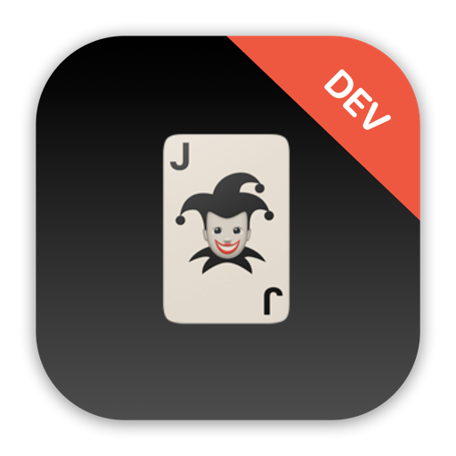

    

    
    
    

  ***Note**: The app icon above should only be used for development purposes only, not for submission to the App Store due to the license on SF Symbols and Emoji.*

 

FitCard is a card randomizer app that is designed to provide users with random exercises based on the given cards.

To start out, the app has a relatively simple but adaptive UI that renders well in both light and dark mode. On the main view, there is only a single random card image with three buttons below the card. The card image will be in constant shuffle the moment the app initializes until the user taps on the **Stop!** button. To resume the shuffling, the user can simply tap on the **Reset** button to start the process of randomizing the cards again.

When the user taps the **Stop!** button, it will display a random card and depending on the *type* and/or *numbers* of the card, the user will have to perform an exercise movement with a certain number of repetitions. Currently, there are four types of exercises in the **Rules** view with their associated card types as follows:

* *clubs* ♠️ = Push-ups
* *hearts* ♥ = Sit-ups
* *spades* ♣️ = Burpees
* *diamonds* ♦️ = Jumping Jacks

As for the repetitions, the value of each card represents the number of exercise that the user must do. For non-number face cards, such as **King** & **Queen**, the following rules apply:

* *J* = 11 reps
* *Q* = 12 reps
* *K* = 13 reps
* *A* = 14 reps

To view the card rules in-app, the user can simply tap on the **Rules** button to bring up the view with the above listed rules.

## App preview

https://user-images.githubusercontent.com/65307853/184556960-722d10e6-ca48-4437-8ac5-de801657f9bd.mp4

## Trying it yourself

FitCard is written using Xcode 13.2 and Swift 5.5. It is built in UIKit, 100% programmatically with the utilization of the new built-in UIKit buttons released in iOS 15 . To try it out, you can clone this project and build it immediately by opening `FitCard.xcodeproj`.

As far as I know the app feature is complete, but there are likely to be errors all over the place at least to begin with – if you hit any problems, either building or running the app, please let me know.

## Important notes on usage

Keep in mind that this app is simply a project designed and built for my own personal reference point and educational purposes only. The sole purpose for this app project was to gain practical experience in building an app in iOS with Swift & UIKit programmatically. The state of this app was never meant to be production-ready, published onto the App Store, or to be monetized in any way, shape, or form.

If you wish to do any of the above, you will have to make some changes to the app before submitting to the App Store for approval. Please keep in mind of any potential violation of third-party license, such as, but not limited to, the usage of SF Symbols and/or Emoji of the app icon.

## Credits

Swift, the Swift logo, Xcode, Instruments, SF Symbols, Emoji, Cocoa Touch, iPhone, iPad, Safari, App Store, watchOS, tvOS, Mac and macOS are trademarks of Apple Inc., registered in the U.S. and other countries.

## License 

This project is under the terms of the MIT license. For more information, please refer to the license [documentation](LICENSE).
